Отчет allure при прохождении всех кейсов:
1) Overview - 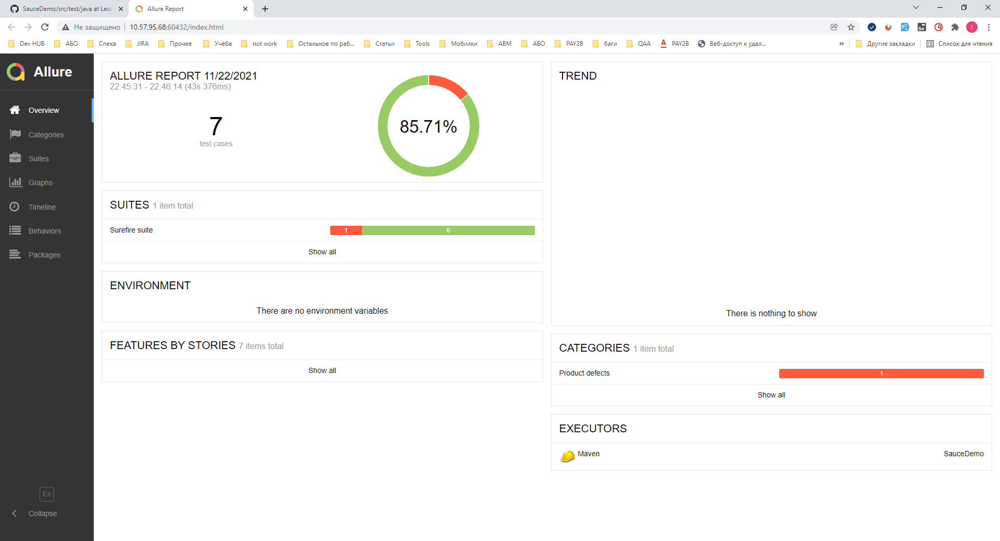
2) Suites - 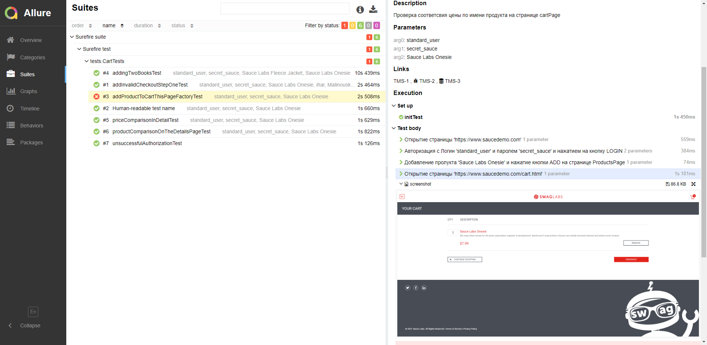

Команды для работы с MAVEN для проекта SauceDemo:
1) mvn versions:display-dependency-updates - просмотр доступных "свежих" версий для библиотек этого проекта

Response:
[INFO] The following dependencies in Dependencies have newer versions:
[INFO]   org.seleniumhq.selenium:selenium-java .............. 3.141.59 -> 4.0.0
[INFO]
[INFO] ------------------------------------------------------------------------
[INFO] BUILD SUCCESS
[INFO] ------------------------------------------------------------------------
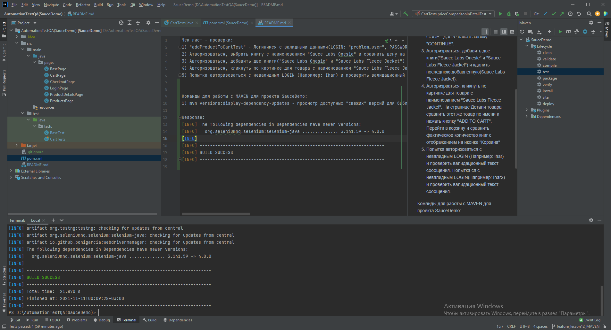

2) mvn versions:use-latest-versions - команда для обновления всех доступных "свежих" версий "одним махом" (не выполнял у себя, так как считаю версию selenium-java:3.141.59 самой стабильной для моего проекта:)

3) Поместил все версии в properties
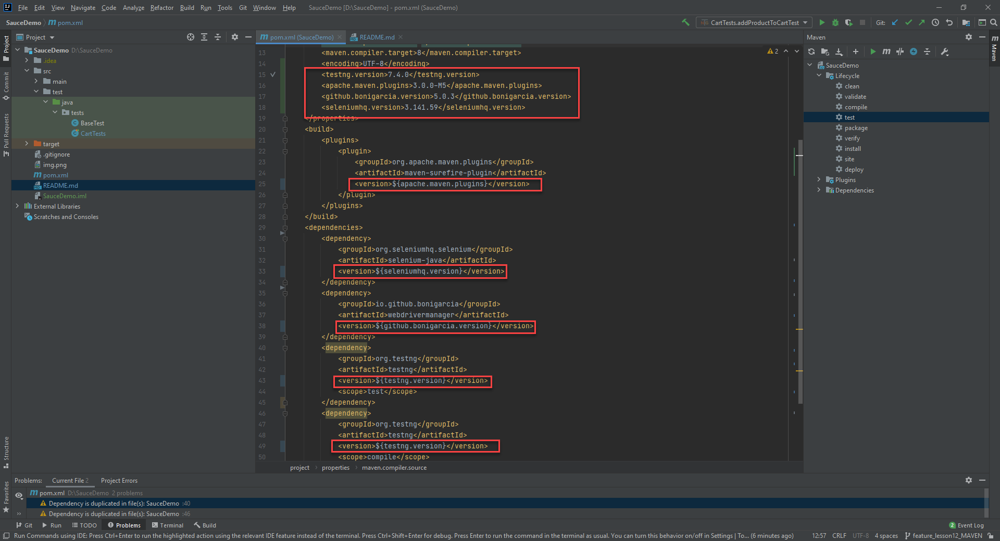
   
4) Добавил команду для MAVEN в конфигурации:
    - SauceDemo [mvn,clean,test] (почистить и запустить все кейсы)
    - SauceDemo [mvn,clean,-Dtest=CartTest] (почистить и запустить все методы из класса CartTest)
    - SauceDemo [mvn clean -Dtest=CartTest#priceComparisonInDetailTest] (запускаем метод priceComparisonInDetailTest из класса CartTest )
    - SauceDemo [mvn clean -Dtest=CartTest#priceComparisonInDetailTest+unsuccessfulAuthorizationTest] (запускаем методы priceComparisonInDetailTest и unsuccessfulAuthorizationTest) из класса CartTest)
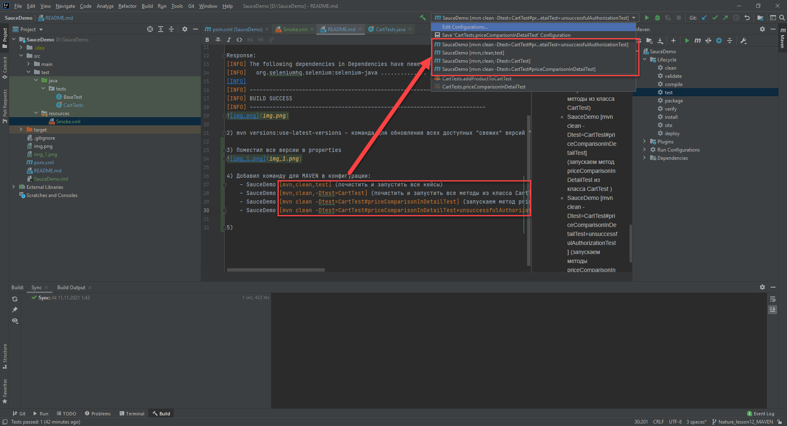

5) mvn clean -Dtest=CartTests#addProductToCartTest -Dlogin=standard_user -Dpassword=secret_sauce test
Запустил через терминал класс CartTests метод addProductToCartTest с логином "standard_user" и паролем "secret_sauce"3

6) mvn clean test -DsuiteXmlFile=src/test/resources/"Smoke.xml
Запуск тестов из терминала из Smoke.xml с параметрами для прогона внутри xml 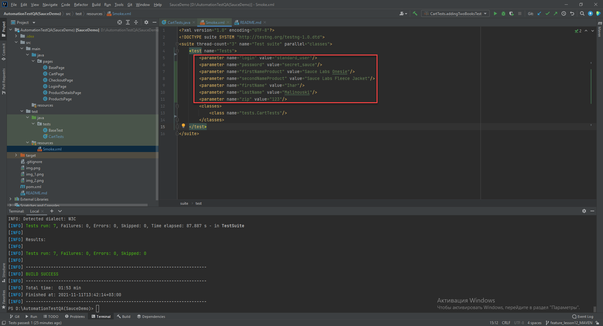
РЕЗУЛЬТАТЫ ПРОГОНА ТЕСТОВ:
Ссылка: localhost:63342/SauceDemo/target/surefire-reports/Test%20suite/Tests.html?_ijt=62j62clpm448u5gq33qa491u96&_ij_reload 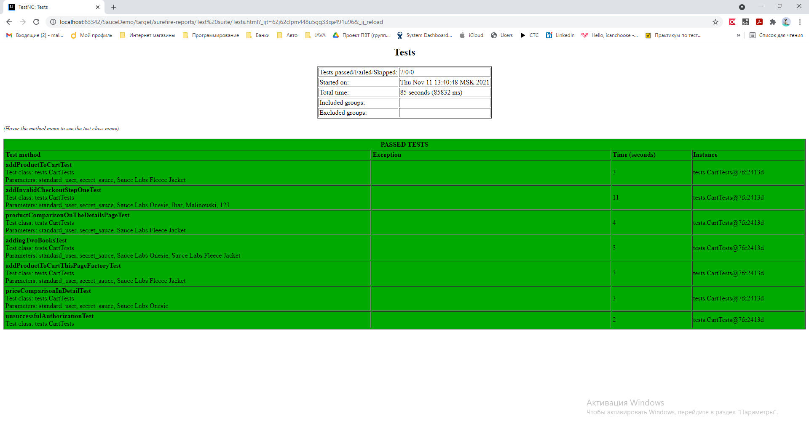
Скрины: 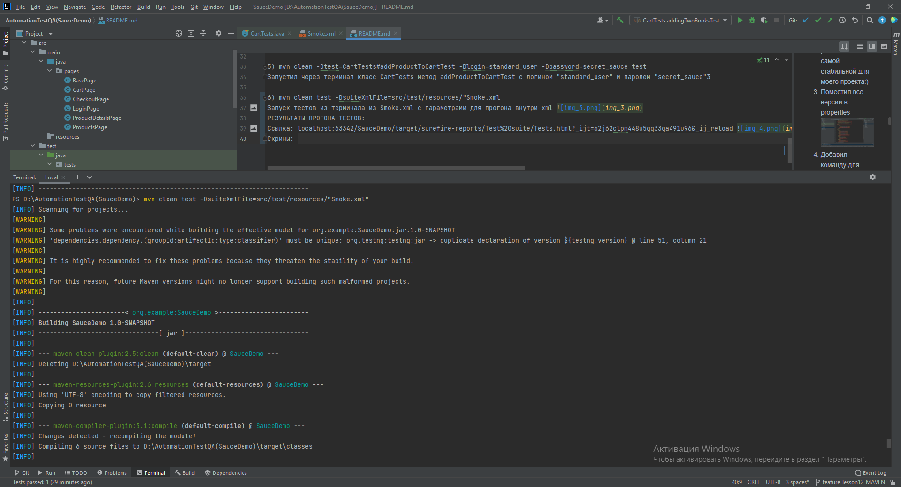  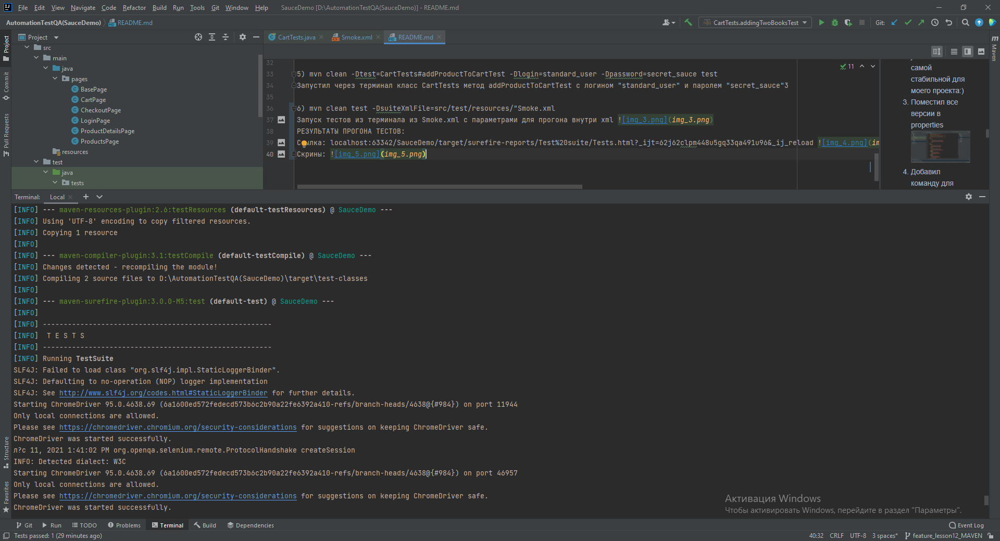  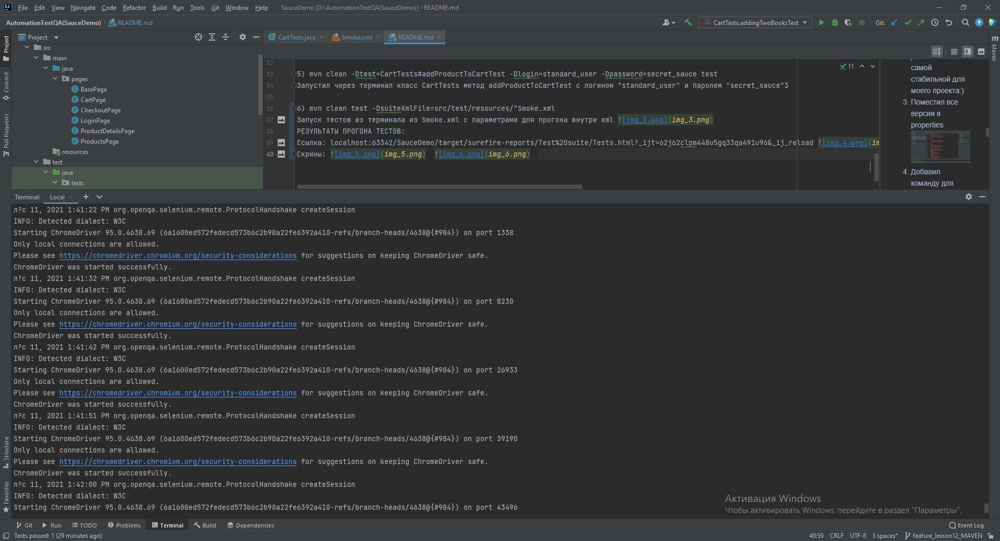 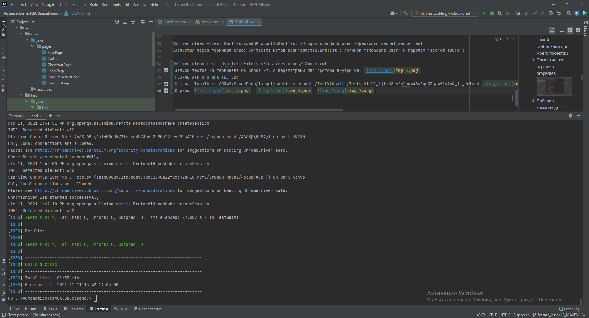

Чек лист - проверки:
1) "addProductToCartTest" - Логинимся с валидными данными(LOGIN: "problem_user", PASSWORD: "secret_sauce"), добавляем товар в корзину, переходим в корзину и проверяем цену товара в корзине (Делали на занятии)
2) Атворизоваться, выбрать книгу с наименованием "Sauce Labs Onesie" и сравнить цену на странице "CartPage", перейти на страницу оплаты (CheckoutPage), ввести валидные данные в поля "FIRST NAME", "LAST NAME" и "ZIP/POSTAL CODE". Далее нажать кнопку "CONTINUE".
3) Авторизрваться, добавить две книги("Sauce Labs Onesie" и "Sauce Labs Fleece Jacket") и кдалить последнюю добавленную(Sauce Labs Fleece Jacket).
4) Авторизрваться, кликнуть по картинке для товара с наименованием "Sauce Labs Fleece Jacket". На странице Детали товара сравнить этот же товар по имени и нажать кнопку "ADD TO CART". Перейти в корзину и сравнить фактическое количество книг с отображением на иконке "Корзина"
5) Попытка авторизоваться с невалидным LOGIN (Например: Ihar) и проверить валидационный текст сообщения. Попытка ся с невалидным LOGIN(Например: Ihar2) и проверить валидационный текст сообщения.

